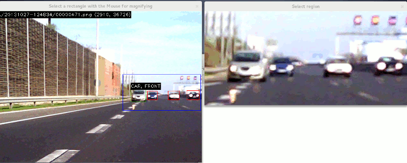

# Training-object Selector 

   

> UI program based on OpenCV to select and label rectangles on images for training object detection algorithms.

## Table of contents
* [Short description](#short)
* [Description](#description)
* [Usage](#usage)
* [Output file format](#output)
* [Features](#features)

## Short

Training object selector allows users to select objects from many images in order to train object detection algorithm 
with them.



## Description

See on the OpenCV documentation, what
[training](http://docs.opencv.org/doc/user_guide/ug_traincascade.html) is. In a nutshell:

If you want to use opencv_haartraining or opencv_traincascade, you have to have tons of images with
the appropriate objects selected and labeled. Namely 
positive and negative ("background") images. Positive samples are images on which there are rectangular areas which are
labeled according to your needs.

My program helps you with selecting and labeling objects on images.

For example, you want to train a detector for car's front view, you need to create two lists of samples. One consists of
pictures of car's front views, the others consists of negative samples, aka backgrounds.

The input list of of a trainer is like this (from the OpenCV documentation)

```
img/img1.jpg  1  140 100 45 45
img/img2.jpg  2  100 200 50 50   50 30 25 25
```

The first number is the count of objects, the remaining numbers are for rectangles (x,y,width,height).

We also need a list of background images:

```
img/img1.jpg
img/img2.jpg
```

My program helps you with creating these two files.

## Usage

What you only need is 
* to create many same-sized images which contain objects and backgrounds
* use my program to select rectangles of objects on images and label them, or label the background images.

## Output

HaarSelector creates an output list, like this:

```
CAR_FRONT ./20131027-121836/00000134.png 1 434 213 167 123
CAR_FRONT ./20131027-121836/00000135.png 1 450 236 176 138
background ./20131027-121836/00000142.png
background ./20131027-121836/00000143.png
CAR_FRONT ./20131027-121836/00000144.png 1 425 249 65 52
CAR_FRONT ./20131027-121836/00000145.png 1 408 235 63 51
CAR_FRONT ./20131027-121836/00000146.png 1 440 249 53 42
```

You can filter this list later to ouput the different types of lines
(here "background" and "CAR_FRONT") to different files (example: background.txt, car_front.txt)

Than create a vector od samples:
>./opencv_createsamples -vec vecout.dat -bg bakcground.txt -info car_front.txt -show

Its output is vecout.dat.

Than train:
>./opencv_traincascade -bg bakcground.txt -data train -vec vecout.dat -numPos 400

where numPos is less than the number of samples in vecout.dat.

For more info on opencv_createsamples and opencv_traincascade, see OpenCV documentation.


## Features
* Magnify a rectangle to help select more precisely
* Auto-tracking selected object from one image to the next, so you do not need to select the same object on the next image
if the object did not change a lot
* loading saved selections at startup so you can continue work
* labeling with two categories (type and subtype), forexample "CAR", "FRONT", if you selected a car in a front-view


