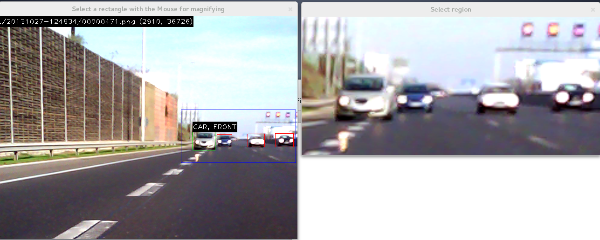

# Manual

## Keys

*arrows*
* left - go to the previous image (circular, so the if there is no previous picture, it jumps to the last)
* right - go to the next image (circular)
* up - go 10 images ahead
* down - go 10 images backward

*normal keys*
* w - writes selections into outputfiles
* l - load selections from file. Do not use this, because program automatically do this on startup.
    when loading selections, loaded selections are added to the existing selections. 
* d - deletes the active selection. The active selection is which has a green rectangle and label is showed
* t - change the type for the active selection
* s - change the subtype for the active selection

*special keys*
* ESC - exit from the program. Nothing will be saved, so use "w" frequently.

## Windows

There are two windows. You can magnify parts of the image on the first and select regions on the second.

### The first window shows (on the left):

* the existing selections, with red rectangles
* the active selection with green rectangle and label
* the name and path of the image, the number of the image and if it is background (in the top left corner)
* if you draw a rectangle on this window (keep down th left mouse button) the selected area will be magnifyied
on the second window 
* if you move the mouse, the active selection will change

### The second window (on the right)

It is for creating selections. So if you draw a rectangle and click with the right mouse button
(or move the mouse to the first window) the selection will be saved and showed on the first window.
